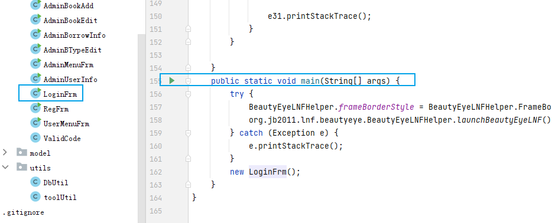
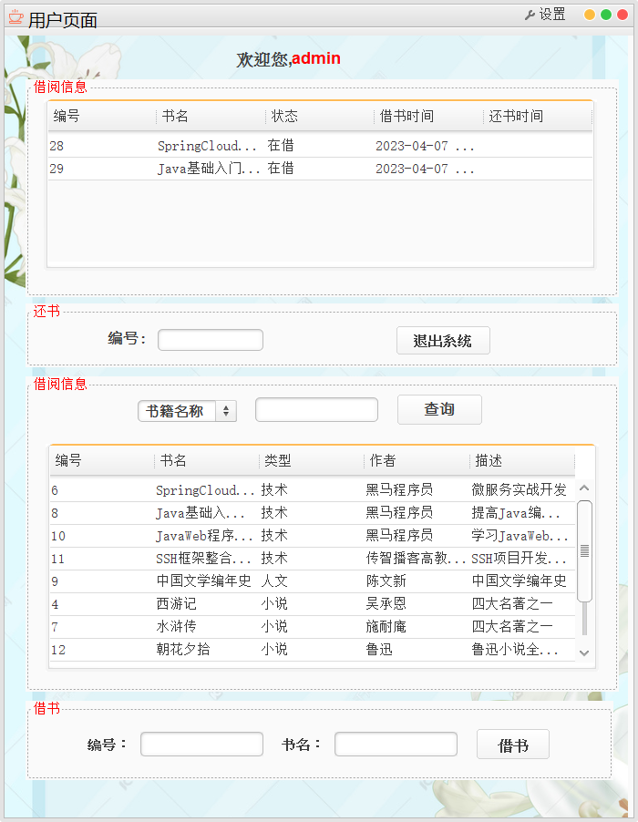

# java-idea-bookmanager

#### 介绍
基于Swing的java 图书管理系统（简版）框架程序。

#### 软件架构
软件架构说明

基于C/S架构 + Java SWing

#### 安装教程

1.  安装配置MySQL 5.5以上数据库系统    
2.  连接数据库,创建 bookmanager 数据库导入doc/bookmanager.sql    
3.  执行查询，创建相关表并插入数据  

#### 使用说明

1. 运行 JFrame/LoginFrm.java

- 用户名  admin 密码 111111

